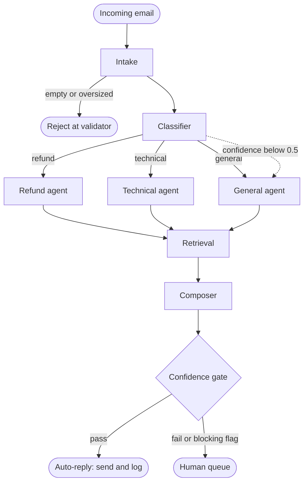

# Architecture — Customer Support Resolution Desk

How the system is put together: the pipeline, the shared state that flows
through it, the tech stack it's built on, and worked examples showing every
transition end to end.

For the contracts each component must honour, see `requirements.md`.
For the "why does this exist" background, see `idea.md`.

## The flow

ASCII (renders in any viewer):

```text
          Incoming email
                |
                v
           +---------+
           | Intake  |  cleans text, extracts order_id, customer_id
           +---------+
           |         \
           |          \-- empty / oversized --> Reject at validator
           v
       +------------+
       | Classifier |  returns category + confidence + reason (validated schema)
       +------------+
         |    |    |
  refund |    | tech
         v    v    v general  (or: confidence < 0.5 -> general)
     +--------+ +----------+ +---------+
     | Refund | | Technical| | General |
     +--------+ +----------+ +---------+
         \        |         /
          \       |        /
           v      v       v
            +------------+
            | Retrieval  |  top passages from help docs; emits retrieval_score
            +------------+
                  |
                  v
            +------------+
            |  Composer  |  writes draft_reply with citations; no ungrounded claims
            +------------+
                  |
                  v
         < Confidence gate >   4 signals, deterministic Python
            |            |
       pass |            | fail  OR  blocking flag
            v            v
     Auto-reply     Human queue
     (send+log)     (draft + sources + category + reason)
```

Mermaid (renders on GitHub, Warp preview, VS Code with the Mermaid extension,
JetBrains with the Mermaid plugin):



## Shared state

Every field written by → read by. Defined once, in `src/support_desk/state.py`.
This is what makes the pipeline auditable.

- **Entry**: `trace_id`, `raw_email`
- **Intake**: `clean_text`, `order_id`, `customer_id`
- **Classifier**: `category`, `class_confidence`, `class_reason`
- **Any node**: `flags` (e.g. `order_not_found`)
- **Specialist**: `findings`
- **Retriever**: `retrieved_chunks`, `retrieval_score`
- **Composer**: `draft_reply`, `citations`
- **Gate**: `decision`, `gate_reason`
- **Bookkeeping**: `tool_calls`, `cost_gbp`

## Tech stack

- **Orchestration** — LangGraph. Conditional edges are first-class, which is
  exactly what a routing project needs.
- **Model access** — any provider, through `src/support_desk/models/gateway.py`.
  The routing decision is cheap and structured; only the composer needs a
  stronger model.
- **Retrieval** — ChromaDB with a persistent directory. Runs locally with no
  server; the index can be committed for Colab users.
- **Chunking** — LangChain's `RecursiveCharacterTextSplitter`. Help articles
  have headings, so splitting on structure beats splitting on length.
- **Structured output** — pydantic schemas via `with_structured_output`. The
  category must be one of three values, guaranteed, not hopefully.

## Folder layout

```
config/settings.yaml          models, limits, memory, gate thresholds
config/prompts/*.md           one prompt per agent, version controlled
src/support_desk/
  main.py                     CLI: process one email or a whole folder
  config.py                   loads settings.yaml + .env into one object
  state.py                    SupportState, defined exactly once
  graph.py                    nodes and edges; no business logic
  agents/                     intake, classifier, refund, technical, general, composer
  tools/                      order_lookup, policy_lookup. A tool never calls a model
  memory/                     vector_store (Chroma), ticket_store (SQLite)
  models/                     gateway.py (the only LLM caller), schemas.py
  guardrails/                 gate.py, validators.py, limits.py. Nothing calls a model
  utils/                      logging.py, tokens.py
data/raw/help_articles/       30-50 short help articles
data/raw/emails/              40 sample emails, 20 labelled
data/index/                   Chroma persistent directory
artifacts/runs/               one folder per run: state, log, outputs
scripts/                      build_index, seed_db, run_eval
tests/unit  tests/integration  tests/fixtures
app/streamlit_app.py          demonstration interface
```

## End-to-end worked examples

Three concrete emails showing every state transition and gate check.
Thresholds used below are the ones in `config/settings.yaml`:

- `min_class_confidence = 0.6`
- `min_retrieval_score  = 0.35`
- `min_citations        = 1`

### Example A — happy path (auto-reply)

```text
 +-------------------------------------------------------+
 | RAW EMAIL   From: alice@example.com                   |
 |             Subject: Refund for order 10234           |
 |             "...kettle on the 5th (order 10234)       |
 |              arrived dented. I'd like a refund."      |
 |             -- Alice Smith | Marketing | +44 ...      |
 +---------------------------+---------------------------+
                             |
                             v
 +-------------------------------------------------------+
 |  INTAKE                                               |
 |    clean_text  = "...arrived dented. Refund please."  |
 |    order_id    = "10234"                              |
 |    customer_id = "alice@example.com"                  |
 |    flags       = []                                   |
 |    (signature stripped so it can't pollute retrieval) |
 +---------------------------+---------------------------+
                             |
                             v
 +-------------------------------------------------------+
 |  CLASSIFIER                                           |
 |    category         = "refund"                        |
 |    class_confidence = 0.94                            |
 |    class_reason     = "explicit refund request tied   |
 |                        to a specific order id"        |
 +---------------------------+---------------------------+
                             |
                             v  (category == refund)
 +-------------------------------------------------------+
 |  REFUND AGENT                                         |
 |    findings    = "order 10234, within 30-day window"  |
 |    eligibility = "eligible"                           |
 |    policy_refs = ["returns_policy.md"]                |
 +---------------------------+---------------------------+
                             |
                             v
 +-------------------------------------------------------+
 |  RETRIEVAL                                            |
 |    returns_policy.md  score 0.78                      |
 |    refunds_faq.md     score 0.71                      |
 |    damaged_items.md   score 0.66                      |
 |    -> retrieval_score = 0.78                          |
 +---------------------------+---------------------------+
                             |
                             v
 +-------------------------------------------------------+
 |  COMPOSER                                             |
 |    draft_reply = "Hi Alice, ...30-day returns window  |
 |                   [returns_policy.md], eligible for   |
 |                   full refund. Post back using label  |
 |                   [damaged_items.md]; refund in 5-7   |
 |                   days [refunds_faq.md]."             |
 |    citations = [returns_policy.md, damaged_items.md,  |
 |                 refunds_faq.md]                       |
 +---------------------------+---------------------------+
                             |
                             v
              +--------------------------------+
              |   CONFIDENCE GATE (4 checks)   |
              |                                |
              |   blocking flag ?  no    PASS  |
              |   class_conf 0.94 >= 0.6 PASS  |
              |   retr_score 0.78 >= 0.35 PASS |
              |   citations  3    >= 1   PASS  |
              |                                |
              |   decision = auto_reply        |
              +--------------+-----------------+
                             |
                             v
                    ( SEND REPLY + LOG )
```

### Example B — escalated because retrieval found nothing relevant

```text
 +-------------------------------------------------------+
 | RAW EMAIL   From: bob@example.com                     |
 |             Subject: Does your kettle work with a     |
 |                      caravan solar inverter?          |
 |             "...run it off a 300W pure-sine inverter  |
 |              in my campervan. Will it work?"          |
 +---------------------------+---------------------------+
                             |
                             v
 +-------------------------------------------------------+
 |  INTAKE                                               |
 |    clean_text  = "...will it work with a 300W         |
 |                   pure-sine inverter?"                |
 |    order_id    = None                                 |
 |    customer_id = "bob@example.com"                    |
 +---------------------------+---------------------------+
                             |
                             v
 +-------------------------------------------------------+
 |  CLASSIFIER                                           |
 |    category         = "technical"                     |
 |    class_confidence = 0.72                            |
 |    class_reason     = "asks about compatibility with  |
 |                        external equipment"            |
 +---------------------------+---------------------------+
                             |
                             v  (category == technical)
 +-------------------------------------------------------+
 |  TECHNICAL AGENT                                      |
 |    findings        = "no matching symptom in the      |
 |                       known-fix list"                 |
 |    suspected_cause = None                             |
 |    fix_refs        = []                               |
 |    flags           = []       (no blocking flag)      |
 +---------------------------+---------------------------+
                             |
                             v
 +-------------------------------------------------------+
 |  RETRIEVAL                                            |
 |    kettle_specs.md  score 0.22                        |
 |    warranty.md      score 0.18                        |
 |    -> retrieval_score = 0.22    (nothing relevant)    |
 +---------------------------+---------------------------+
                             |
                             v
 +-------------------------------------------------------+
 |  COMPOSER                                             |
 |    draft_reply = "I don't have information about      |
 |                   compatibility with third-party      |
 |                   inverters in the help articles."    |
 |    citations   = []          (nothing to cite)        |
 +---------------------------+---------------------------+
                             |
                             v
              +--------------------------------+
              |   CONFIDENCE GATE (4 checks)   |
              |                                |
              |   blocking flag ?  no    PASS  |
              |   class_conf 0.72 >= 0.6 PASS  |
              |   retr_score 0.22 >= 0.35 FAIL |
              |   citations  0    >= 1   FAIL  |
              |                                |
              |   decision = human_queue       |
              +--------------+-----------------+
                             |
                             v
 +-------------------------------------------------------+
 |   HANDOVER PACKET (to human)                          |
 |     draft_reply    (the honest non-answer)            |
 |     retrieved_chunks (what was searched)              |
 |     category       = "technical"                      |
 |     class_reason   = "...compatibility question..."   |
 |     gate_reason    = "retrieval below threshold;      |
 |                       draft has no citations"         |
 +-------------------------------------------------------+
```

### Example C — escalated because of a blocking flag

```text
 +-------------------------------------------------------+
 | RAW EMAIL   From: carol@example.com                   |
 |             Subject: Refund for order 55501 - final   |
 |                      warning                          |
 |             "...if I don't get my money back in 48h   |
 |              I will be speaking to my solicitor and   |
 |              reporting you to Trading Standards."     |
 +---------------------------+---------------------------+
                             |
                             v
 +-------------------------------------------------------+
 |  INTAKE                                               |
 |    clean_text  = "...solicitor...Trading Standards."  |
 |    order_id    = "55501"                              |
 |    customer_id = "carol@example.com"                  |
 |    flags       = [legal_language, angry_tone] <-- !!! |
 +---------------------------+---------------------------+
                             |
                             v
 +-------------------------------------------------------+
 |  CLASSIFIER                                           |
 |    category         = "refund"                        |
 |    class_confidence = 0.96                            |
 |    class_reason     = "refund request tied to 55501"  |
 +---------------------------+---------------------------+
                             |
                             v  (category == refund)
 +-------------------------------------------------------+
 |  REFUND AGENT                                         |
 |    findings    = "order 55501, within window"         |
 |    eligibility = "eligible"                           |
 |    flags       = [legal_language, angry_tone] (kept)  |
 +---------------------------+---------------------------+
                             |
                             v
 +-------------------------------------------------------+
 |  RETRIEVAL                                            |
 |    returns_policy.md   score 0.80                     |
 |    refunds_faq.md      score 0.72                     |
 |    -> retrieval_score = 0.80                          |
 +---------------------------+---------------------------+
                             |
                             v
 +-------------------------------------------------------+
 |  COMPOSER                                             |
 |    draft_reply = "Hi Carol, ...eligible under the     |
 |                   30-day returns policy               |
 |                   [returns_policy.md]..."             |
 |    citations = [returns_policy.md, refunds_faq.md]    |
 +---------------------------+---------------------------+
                             |
                             v
              +--------------------------------+
              |   CONFIDENCE GATE (4 checks)   |
              |                                |
              |   blocking flag ?  YES   FAIL  | <-- hard stop
              |   (other checks don't matter)  |
              |                                |
              |   decision = human_queue       |
              +--------------+-----------------+
                             |
                             v
 +-------------------------------------------------------+
 |   HANDOVER PACKET (to human)                          |
 |     draft_reply    (already grounded and ready)       |
 |     retrieved_chunks                                  |
 |     category       = "refund"                         |
 |     flags          = [legal_language, angry_tone]     |
 |     gate_reason    = "legal_language flag set;        |
 |                       a person must review"           |
 +-------------------------------------------------------+
```

Every numeric signal was excellent, but the flag overrode all of them.

### What the three examples show together

- **A** — all four signals pass, so the system sends. This is the case that
  earns its keep by removing routine work from the queue.
- **B** — the model was willing to try, but the *deterministic* gate noticed
  there was no grounding and stopped. This is the gate doing its job.
- **C** — every other signal looked great, but a single flag overrode
  everything. This is why flags are separate from the numeric thresholds:
  some things are always a person's decision.
